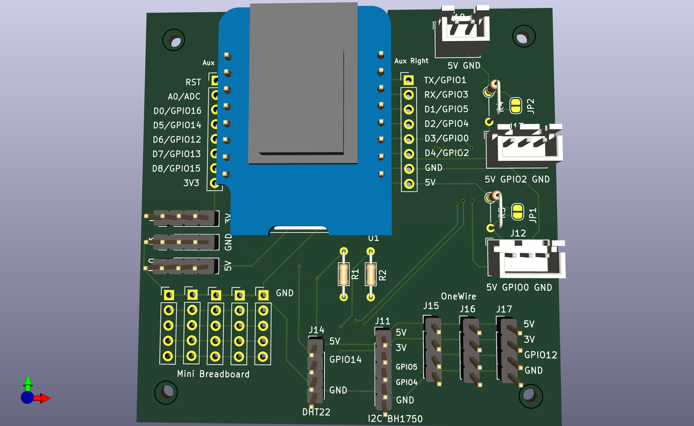

### Simple PCB for Wemos D1 mini projects

- pre wired for default sensors
- mini breadboard
- can use resistors or bridge them
- options to pull your own lines to the breadboard or for debugging
- 7x7cm to fit into standard plastic boxes

My first PCB Design, it has some flaws, will remove the rectangular corners soon and rewire few pinouts.

